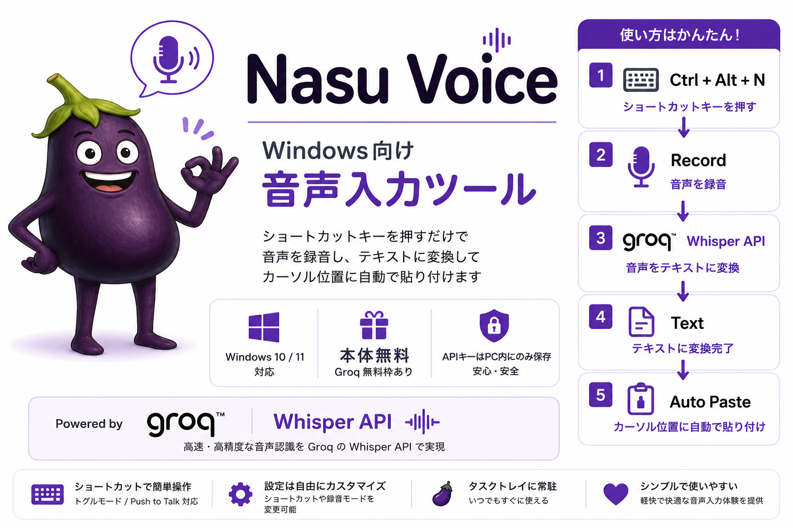

[--> 🇺🇸 English README](README_en.md)

## 概要

Groq Whisper API を使った Windows 向け音声入力ツールです

ショートカットキーを押すだけで音声を録音し、テキストに変換してカーソル位置に貼り付けます

---

## 動作環境

- Windows 10 / 11

---

## 必要なもの

- Groq API キー

---

## Groq API キーについて

Nasu Voice は音声認識に Groq の Whisper API を使用しています

- APIキーは以下のサイトから無料で簡単に取得できます

  https://console.groq.com/

- Groq には無料枠があります。一般的な音声入力の使用量では十分まかなえます

  最新の上限は Groq のサイトでご確認ください（2026年6月時点では1日10万トークン）

- メールアドレスまたはGoogleアカウントで登録できます。クレジットカードは不要です

- **APIキーはあなたのPC内にのみ保存**されます。開発者（作者）には送信されません

- 音声データは文字起こしのために Groq のサーバーへ送信されます。作者には送信されません


**取得手順：**

1. 上記サイトにアクセスしてアカウントを作成します
2. 「Create API Key」をクリックしてAPIキーを発行します


---

## インストール

1. [こちら](https://github.com/tf10cc/nasu_voice/releases/latest) から最新版のセットアップファイル（`Nasu_Voice_v*_Setup.exe`）をダウンロードします
2. ダウンロードしたセットアップファイルを実行します
3. 画面の指示に従ってインストールしてください
4. インストール完了後、Nasu Voice が自動的に起動します
5. 初回起動時に Groq API キーを設定してください

### ダウンロード・インストールできない場合

- Edge でダウンロードできない場合は、**Chrome** でお試しください
- 「WindowsによってPCが保護されました」と表示された場合は、
  「**詳細情報**」→「**実行**」を選んでください
- 「このアプリの発行元を確認できません」と表示された場合は、以下をお試しください
  1. ダウンロードしたファイルを右クリック →「**プロパティ**」を開く
  2. 「セキュリティ」欄の「**許可する**」にチェックを入れて「**OK**」
  3. あらためてファイルを実行する

---

## 設定画面の出し方

インストール後、Nasu Voice は画面右下の通知領域（タスクトレイ）に常駐します

アイコンが見えない場合は、タスクトレイの「∧」をクリックすると 🍆 が表示されます

🍆 を右クリック → 「Settings」で設定画面が開きます

---

## 使い方

- 録音モードは2種類あります
- ショートカットキーや録音モードは設定画面から自由に変更できます

### トグルモード（初期設定）

| 操作 | 内容 |
|---|---|
| ショートカットキー（初期設定: `Ctrl+Alt+N`）を **1回押す** | 録音開始 |
| **もう1回押す** | 録音停止 → テキストに変換 → カーソル位置に貼り付け |

### Push to Talk モード

| 操作 | 内容 |
|---|---|
| ショートカットキーを **押している間** | 録音中 |
| **キーを離す** | 録音停止 → テキストに変換 → カーソル位置に貼り付け |

---

## アンインストール

**Windows の設定 → アプリ → Nasu Voice → アンインストール** で削除できます

アンインストール後も、設定ファイル（`nasu_config.json`）は自動的に残ります

APIキー・辞書・ショートカットキーなどは次回インストール時にそのまま引き継がれます

**設定ファイルも完全に削除したい場合**は、以下の手順で削除してください

1. エクスプローラーのアドレスバーに以下を貼り付けて Enter を押す
   ```
   %AppData%\nasu_voice\
   ```
2. 開いたフォルダの中の `nasu_config.json` を削除する

---

## 更新履歴

変更内容は [CHANGELOG.md](CHANGELOG.md) を参照してください

---

## ライセンス

© 2026 tf10cc. All rights reserved.
