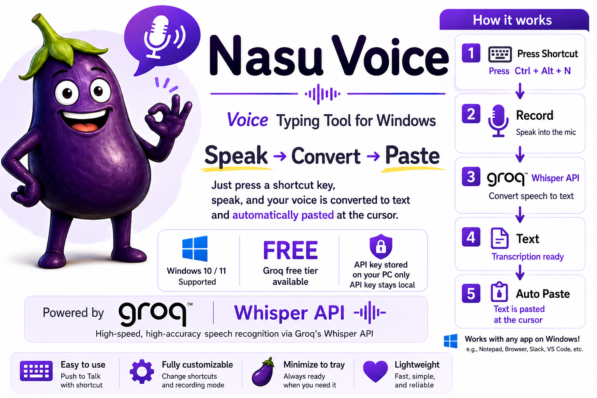

[--> English README](README_en.md) / [--> Japanese README](README.md)

# Nasu Voice

## Azərbaycan üçün qısa izah

Nasu Voice Windows üçün səsdən mətnə çevirmə alətidir.

Qısayol düyməsini basın, danışın və səsiniz mətnə çevrilərək kursorun olduğu yerə avtomatik yapışdırılır.

---

## Əsas xüsusiyyətlər

- Windows 10 / 11 üçün işləyir
- Groq Whisper API ilə səsi mətnə çevirir
- Mətn bir çox Windows tətbiqində kursorun olduğu yerə avtomatik yapışdırılır
- Toggle və Push to Talk rejimlərini dəstəkləyir
- Nasu Voice tətbiqinin özü pulsuzdur

---

## Lazım olan şey

Nasu Voice-dan istifadə etmək üçün Groq API açarı lazımdır.

Groq API açarını buradan əldə edə bilərsiniz:

https://console.groq.com/

- Groq-un pulsuz istifadə limiti var. Limitlər dəyişə bilər, ona görə ən yeni məlumat üçün Groq saytını yoxlayın.
- API açarınız yalnız sizin kompüterinizdə saxlanılır.
- Səs tanınması üçün audio Groq serverlərinə göndərilir. Developerə göndərilmir.

---

## Quraşdırma

> Qeyd: Hazırkı installer interfeysi yapon dilindədir. İngilis dili dəstəyi gələcək versiyada planlaşdırılır.

1. `Nasu_Voice_v1.0.0_Setup.exe` faylını buradan yükləyin:
   https://github.com/tf10cc/nasu_voice/releases/tag/v1.0.0
2. Installer faylını işə salın.
3. Ekrandakı addımları izləyərək quraşdırmanı tamamlayın.
4. İlk işə salınmada Groq API açarınızı daxil edin.

Windows xəbərdarlıq göstərə bilər. Bu, imzalanmamış yeni Windows tətbiqlərində baş verə bilər.

---

## İstifadə qaydası

Standart qısayol düyməsi:

`Ctrl + Alt + N`

Toggle rejimi:

1. Qısayol düyməsini bir dəfə basın: yazma başlayır.
2. Yenə basın: yazma dayanır, mətnə çevrilir və kursorun olduğu yerə yapışdırılır.

Push to Talk rejimi:

1. Qısayol düyməsini basılı saxlayın: yazma davam edir.
2. Düyməni buraxın: yazma dayanır, mətnə çevrilir və yapışdırılır.

---

## Əlaqə

Rəy, sual və ya problem olarsa, GitHub səhifəsində bildirin:

https://github.com/tf10cc/nasu_voice

---

## License

© 2026 tf10cc. All rights reserved.
