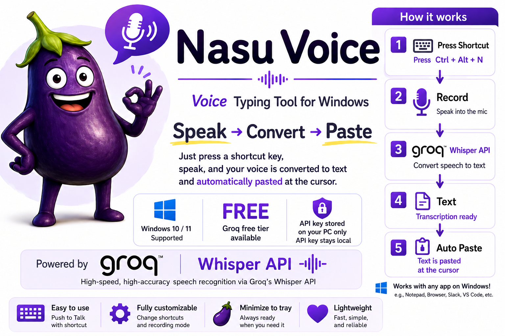

[--> 🇯🇵 日本語 README](README.md)

## Overview

Nasu Voice is a free Windows voice input tool powered by Groq's Whisper API.

Just press a shortcut key, speak, and your voice is converted to text and automatically pasted at the cursor in most applications.

---

## System Requirements

- Windows 10 / 11

---

## What You Need

- A Groq API key

---

## About the Groq API Key

Nasu Voice uses Groq's Whisper API for speech recognition.

- You can get a free API key at: https://console.groq.com/
- Groq offers a free tier. For typical voice input use, it is more than enough.
  Please check Groq's website for the latest limits. (As of June 2026: 100,000 tokens/day)
- No credit card required. Sign up with an email address or Google account.
- **Your API key is stored only on your PC.** It is never sent to the developer.
- Your voice audio is sent to Groq's servers for transcription. It is not sent to the developer.

**How to get your API key:**

1. Visit the URL above and create an account.
2. Click "Create API Key" to generate your key.

---

## Installation

> **Note:** The installer interface is currently in Japanese. English installer support is planned for a future version.

1. Download `Nasu_Voice_v1.0.0_Setup.exe` from [here](https://github.com/tf10cc/nasu_voice/releases/tag/v1.0.0).
2. Run `Nasu_Voice_v1.0.0_Setup.exe`.
3. Follow the on-screen instructions to complete the installation.
4. Nasu Voice will start automatically after installation.
5. Enter your Groq API key when prompted on first launch.

### If Windows Shows a Warning

Windows may display "Windows protected your PC" or "Unknown publisher" when running the installer.

1. Right-click the downloaded file and select **Properties**.
2. At the bottom, check **Unblock** under the Security section, then click **OK**.
3. Run `Nasu_Voice_v1.0.0_Setup.exe` again.

---

## How to Open Settings

After installation, Nasu Voice runs in the system tray (bottom-right corner of the screen).

If you don't see the icon, click the **∧** arrow in the tray to find 🍆.

Right-click 🍆 → select **Settings** to open the settings window.

---

## How to Use

- Two recording modes are available.
- You can change the shortcut key and recording mode in Settings.

### Toggle Mode (Default)

| Action | Result |
|---|---|
| Press shortcut key (default: `Ctrl+Alt+N`) **once** | Start recording |
| Press **again** | Stop recording → Convert to text → Paste at the cursor |

### Push to Talk Mode

| Action | Result |
|---|---|
| **Hold** the shortcut key | Recording |
| **Release** the key | Stop recording → Convert to text → Paste at the cursor |

---

## Uninstall

Go to **Windows Settings → Apps → Nasu Voice → Uninstall**.

After uninstalling, the settings file (`nasu_config.json`) remains on your PC. Your API key, dictionary, and shortcut settings will be carried over if you reinstall.

**To fully remove the settings file**, follow these steps:

1. Paste the following into the File Explorer address bar and press Enter:
   ```
   %AppData%\nasu_voice\
   ```
2. Delete the `nasu_config.json` file in the folder that opens.

---

## License

© 2026 tf10cc. All rights reserved.
